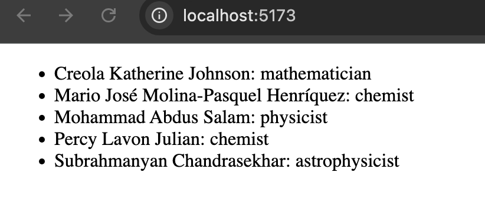

# 1.10 Rendering Lists

```javascript
import PackingList from "./components/PackingList";
import Profile from "./components/Profile";

const people = [
  "Creola Katherine Johnson: mathematician",
  "Mario José Molina-Pasquel Henríquez: chemist",
  "Mohammad Abdus Salam: physicist",
  "Percy Lavon Julian: chemist",
  "Subrahmanyan Chandrasekhar: astrophysicist",
];

export default function App() {
  const listItems = people.map((person) => <li>{person}</li>);
  return (
    <div>
      <div>
        <ul>{listItems}</ul>
      </div>
    </div>
  );
}
```



-------------------------------------------------------------------------------------------------------------------------------

```javascript
import PackingList from "./components/PackingList";
import Profile from "./components/Profile";

const people = [
  "Creola Katherine Johnson: mathematician",
  "Mario José Molina-Pasquel Henríquez: chemist",
  "Mohammad Abdus Salam: physicist",
  "Percy Lavon Julian: chemist",
  "Subrahmanyan Chandrasekhar: astrophysicist",
];

export default function App() {
  return (
    <div>
      <div>
        <ul>
          {people.map((person) => (
            <li>{person}</li>
          ))}
        </ul>
      </div>
    </div>
  );
}
```


**-------------------------------------------------------------------------------------------------------------------------------**

```javascript

import PackingList from "./components/PackingList";
import Profile from "./components/Profile";

const people = [
  {
    id: 0,
    name: "Creola Katherine Johnson",
    profession: "mathematician",
  },
  {
    id: 1,
    name: "Mario José Molina-Pasquel Henríquez",
    profession: "chemist",
  },
  {
    id: 2,
    name: "Mohammad Abdus Salam",
    profession: "physicist",
  },
  {
    id: 3,
    name: "Percy Lavon Julian",
    profession: "chemist",
  },
  {
    id: 4,
    name: "Subrahmanyan Chandrasekhar",
    profession: "astrophysicist",
  },
];

export default function App() {
  const chemists = people.filter((person) => person.profession === "chemist");
  const listItems = chemists.map((chemist) => <li>{chemist.name}</li>);
  return (
    <div>
      <div>
        <ul>{listItems}</ul>
      </div>
    </div>
  );
}
```


-------------------------------------------------------------------------------------------------------------------------------

**Method Chaining**
```javascript
import PackingList from "./components/PackingList";
import Profile from "./components/Profile";

const people = [
  {
    id: 0,
    name: "Creola Katherine Johnson",
    profession: "mathematician",
  },
  {
    id: 1,
    name: "Mario José Molina-Pasquel Henríquez",
    profession: "chemist",
  },
  {
    id: 2,
    name: "Mohammad Abdus Salam",
    profession: "physicist",
  },
  {
    id: 3,
    name: "Percy Lavon Julian",
    profession: "chemist",
  },
  {
    id: 4,
    name: "Subrahmanyan Chandrasekhar",
    profession: "astrophysicist",
  },
];

export default function App() {
  const chemists = people
    .filter((person) => person.profession === "chemist")
    .map((chemist) => <li>{chemist.name}</li>);
  return (
    <div>
      <div>
        <ul>{chemists}</ul>
      </div>
    </div>
  );
}
```


-------------------------------------------------------------------------------------------------------------------------------

```javascript
import PackingList from "./components/PackingList";
import Profile from "./components/Profile";

const people = [
  {
    id: 0,
    name: "Creola Katherine Johnson",
    profession: "mathematician",
  },
  {
    id: 1,
    name: "Mario José Molina-Pasquel Henríquez",
    profession: "chemist",
  },
  {
    id: 2,
    name: "Mohammad Abdus Salam",
    profession: "physicist",
  },
  {
    id: 3,
    name: "Percy Lavon Julian",
    profession: "chemist",
  },
  {
    id: 4,
    name: "Subrahmanyan Chandrasekhar",
    profession: "astrophysicist",
  },
];

export default function App() {
  const chemists = people
    .filter((person) => person.profession === "chemist")
    .map((chemist) => <li key={chemist.id}>{chemist.name}</li>);
  return (
    <div>
      <div>
        <ul>{chemists}</ul>
      </div>
    </div>
  );
}
```


-------------------------------------------------------------------------------------------------------------------------------

```javascript
import { Fragment } from "react";
import PackingList from "./components/PackingList";
import Profile from "./components/Profile";

const people = [
  {
    id: 0,
    name: "Creola Katherine Johnson",
    profession: "mathematician",
  },
  {
    id: 1,
    name: "Mario José Molina-Pasquel Henríquez",
    profession: "chemist",
  },
  {
    id: 2,
    name: "Mohammad Abdus Salam",
    profession: "physicist",
  },
  {
    id: 3,
    name: "Percy Lavon Julian",
    profession: "chemist",
  },
  {
    id: 4,
    name: "Subrahmanyan Chandrasekhar",
    profession: "astrophysicist",
  },
];

export default function App() {
  const chemists = people
    .filter((person) => person.profession === "chemist")
    .map((chemist) => <Fragment key={chemist.id}>{chemist.name}</Fragment>);
  return (
    <div>
      <div>
        <ul>{chemists}</ul>
      </div>
    </div>
  );
}
```


-------------------------------------------------------------------------------------------------------------------------------

**But, it is not recommended to use index**
```javascript
import { Fragment } from "react";
import PackingList from "./components/PackingList";
import Profile from "./components/Profile";

const people = [
  {
    id: 0,
    name: "Creola Katherine Johnson",
    profession: "mathematician",
  },
  {
    id: 1,
    name: "Mario José Molina-Pasquel Henríquez",
    profession: "chemist",
  },
  {
    id: 2,
    name: "Mohammad Abdus Salam",
    profession: "physicist",
  },
  {
    id: 3,
    name: "Percy Lavon Julian",
    profession: "chemist",
  },
  {
    id: 4,
    name: "Subrahmanyan Chandrasekhar",
    profession: "astrophysicist",
  },
];

export default function App() {
  const chemists = people
    .filter((person) => person.profession === "chemist")
    .map((chemist, index) => <li key={index}>{chemist.name}</li>);
  return (
    <div>
      <div>
        <ul>{chemists}</ul>
      </div>
    </div>
  );
}
```