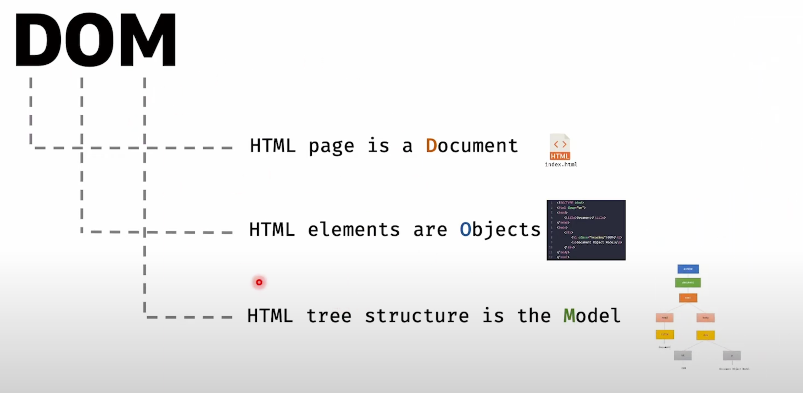

# 03 - How React Works - Virtual DOM
## Real DOM -> is not slow
### What is DOM?
JavaScript makes a page interactive using the DOM, by manipulating DOM.

**DOM** -> 
- **D** -> Document, HTML page is a Document.
- **O** -> Object, HTML Elements are Objects.
- **M** -> Model, HTML tree structure is the Model.


--------------------------------------------------------------------------------------------------------------------------------


when we change something on the code, the below red marked part again render, means the render tree build again
Actually DOM is not slow, the painting process is slow.

### So, What is the best we can do about?
1. Batch Update
2. Less DOM Update

#### Batch Update
**Using vanilla javascript and HTML**
```html
<!DOCTYPE html>
<html lang="en">
  <head>
    <meta charset="UTF-8" />
    <meta http-equiv="X-UA-Compatible" content="IE=edge" />
    <meta name="viewport" content="width=device-width, initial-scale=1.0" />
    <title>Document</title>
  </head>
  <body>
    <div class="container"></div>
    <script src="./dom.js"></script>
  </body>
</html>
```
```javascript
/*
 * Title: Main Script file
 * Description: A vanilla JS Implementation of costly DOM manipulation vs efficient DOM manipulation
 * Author: Sumit Saha ( Learn with Sumit )
 * Date: 07/01/2023
 *
 */

let array = [];
increment = 0;
let container = document.querySelector(".container");

// fast
while (increment < 10000) {
    array.push(++increment);
}

container.innerHTML = array.join(" ");

// slow

// while (increment < 10000) {
//     increment++;
//     container.innerHTML += " " + increment;
// }
```

--------------------------------------------------------------------------------------------------------------------------------

**Batch Update using React**
To do the Batch Update using React, at first React will work for Virtual DOM.
It will need two things ->
- state of Before Update
- state of after Update
then comparing these two, it will change in the DOM, where need to change.
It will first do the rough work on Virtual DOM(javascript's Object, a replica of Real DOM), then it will change on the Real DOM.
