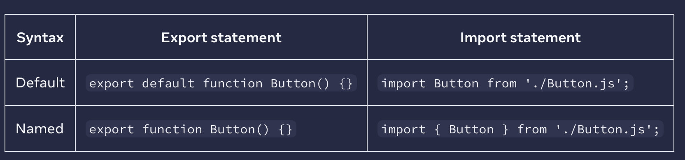

# 1.5 - Basics of React Components: Importing & Exporting Components

For react root component is **one**.
though. If you use a framework with **file-based** routing, such as **Next.js**, your **root** component will be **different** for every page.

**You may encounter files that leave off the .js file extension like so:**

```javascript
import Gallery from "./Gallery";
```

**---------------------------------------------------------------------------------------------------------------------------**

## Default vs named exports

There are two primary ways to export values with JavaScript: default exports and named exports. So far, our examples have only used default exports. But you can use one or both of them in the same file. **A file can have no more than one default export, but it can have as many named exports as you like.**


When you write a default import, you can put any name you want after import. For example, you could write import Banana from './Button.js' instead and it would still provide you with the same default export. In contrast, with named imports, the name has to match on both sides. That’s why they are called named imports!

**People often use default exports if the file exports only one component, and use named exports if it exports multiple components and values**. Regardless of which coding style you prefer, always give meaningful names to your component functions and the files that contain them. Components without names, like export default () => {}, are discouraged because they make debugging harder.

```javascript
//? Named Import
import { Profile } from "./components/Gallery";
//? Default Import
import Gallery from "./components/Gallery";


export default function App() {
  return (
    <div>
      <div>
        <Profile />
        <Gallery />
      </div>
    </div>
  );
}
```
we can import files in one line. Like below:
```javascript
import Gallery, {Profile} from "./components/Gallery"
```

---------------------------------------------------------------------------------------------------------------------------

### We can also rename import name and it is called import alias
```javascript
//? Named Import
import { Profile as P } from "./components/Gallery";
//? Default Import
import Gal from "./components/Gallery";

export default function App() {
  return (
    <div>
      <div>
        <P />
        <Gal />
      </div>
    </div>
  );
}
```