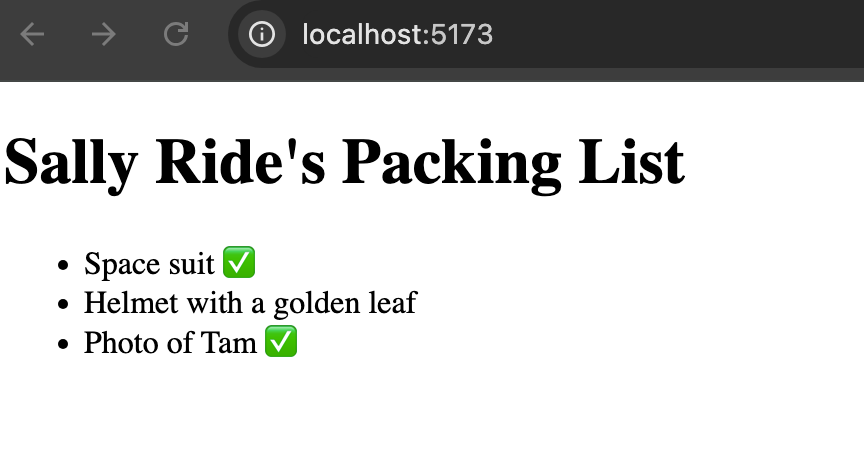

# 1.9 - Conditional Rendering
```javascript
function Item({ name, isPacked }) {
  if (isPacked) {
    return <li className="item">{name} ✅</li>;
  }
  return <li className="item">{name}</li>;
}

export default function PackingList() {
  return (
    <section>
      <h1>Sally Ride's Packing List</h1>
      <ul>
        <Item isPacked={true} name="Space suit" />
        <Item isPacked={false} name="Helmet with a golden leaf" />
        <Item isPacked={true} name="Photo of Tam" />
      </ul>
    </section>
  );
}
```


-------------------------------------------------------------------------------------------------------------------------

```javascript
function Item({ name, isPacked }) {
  if (isPacked) {
    return null;
  }
  return <li className="item">{name}</li>;
}

export default function PackingList() {
  return (
    <section>
      <h1>Sally Ride's Packing List</h1>
      <ul>
        <Item isPacked={true} name="Space suit" />
        <Item isPacked={false} name="Helmet with a golden leaf" />
        <Item isPacked={true} name="Photo of Tam" />
      </ul>
    </section>
  );
}
```


-------------------------------------------------------------------------------------------------------------------------

```javascript
function Item({ name, isPacked }) {
  return <li className="item">{isPacked ? name + " ✅" : name}</li>;
}

export default function PackingList() {
  return (
    <section>
      <h1>Sally Ride's Packing List</h1>
      <ul>
        <Item isPacked={true} name="Space suit" />
        <Item isPacked={false} name="Helmet with a golden leaf" />
        <Item isPacked={true} name="Photo of Tam" />
      </ul>
    </section>
  );
}
```

-------------------------------------------------------------------------------------------------------------------------

```javascript
function Item({ name, isPacked }) {
  return (
    <li className="item">
      {isPacked ? (
        <del>
          {name + ' ✅'}
        </del>
      ) : (
        name
      )}
    </li>
  );
}

export default function PackingList() {
  return (
    <section>
      <h1>Sally Ride's Packing List</h1>
      <ul>
        <Item 
          isPacked={true} 
          name="Space suit" 
        />
        <Item 
          isPacked={true} 
          name="Helmet with a golden leaf" 
        />
        <Item 
          isPacked={false} 
          name="Photo of Tam" 
        />
      </ul>
    </section>
  );
}
```


-------------------------------------------------------------------------------------------------------------------------

```javascript
function Item({ name, isPacked }) {
  return <li className="item">{name} {isPacked&& '✅'}</li>;
}

export default function PackingList() {
  return (
    <section>
      <h1>Sally Ride's Packing List</h1>
      <ul>
        <Item isPacked={true} name="Space suit" />
        <Item isPacked={false} name="Helmet with a golden leaf" />
        <Item isPacked={true} name="Photo of Tam" />
      </ul>
    </section>
  );
}
```


-------------------------------------------------------------------------------------------------------------------------

```javascript
function Item({ name, isPacked }) {
  let itemContent = "";

  if(isPacked) {
    itemContent = <span>{name + "✅"}</span>;
  }else {
    itemContent = <span>{name}</span>
  }

  return <li className="item">{itemContent}</li>
}

export default function PackingList() {
  return (
    <section>
      <h1>Sally Ride's Packing List</h1>
      <ul>
        <Item isPacked={true} name="Space suit" />
        <Item isPacked={false} name="Helmet with a golden leaf" />
        <Item isPacked={true} name="Photo of Tam" />
      </ul>
    </section>
  );
}
```


**-------------------------------------------------------------------------------------------------------------------------**

```javascript
const lang = "Go";
const result = lang && "Javascript";

console.log(result);
```
```bash
Javascript
```

-------------------------------------------------------------------------------------------------------------------------

```javascript
const lang = "Go";
const result = lang || "Javascript";

console.log(result);
```
```bash
Go
```

-------------------------------------------------------------------------------------------------------------------------

```javascript
//! Nullish Coalescing(null/undefined) Operator
const lang = "Go";
const result = lang ?? "Javascript";

console.log(result);
```
```bash
Go
```

