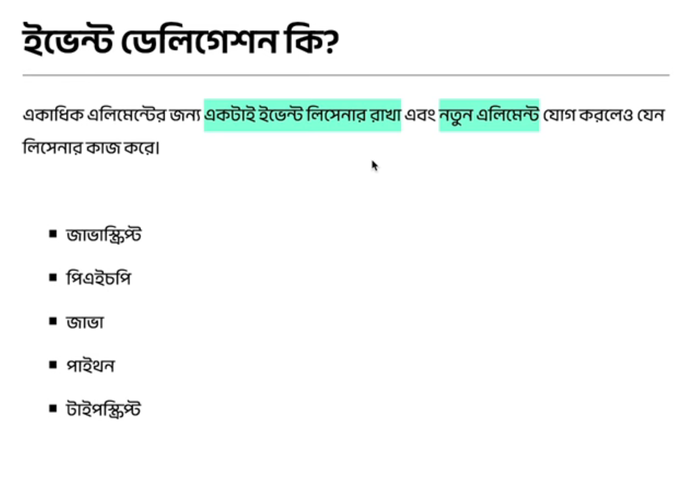

# 2.2 Responding to Events - Event Propagation

## Event Delegation


if there is a button, where clicking new element added to list, then the event listner also shoud work for that newly added list item.

```html
<!DOCTYPE html>
<html lang="en">
  <head>
    <meta charset="UTF-8" />
    <meta name="viewport" content="width=device-width, initial-scale=1.0" />
    <title>Event Delegation</title>
    <link rel="preconnect" href="https://fonts.googleapis.com" />
    <link rel="preconnect" href="https://fonts.gstatic.com" crossorigin />
    <link
      href="https://fonts.googleapis.com/css2?family=Anek+Bangla:wght@400;600&display=swap"
      rel="stylesheet"
    />
    <link rel="stylesheet" href="./style.css" />
  </head>
  <body>
    <div class="container">
      <h1>ইভেন্ট ডেলিগেশন কি?</h1>

      <p>
        একাধিক এলিমেন্টের জন্য
        <span class="highlight">একটাই ইভেন্ট লিসেনার রাখা</span> এবং
        <span class="highlight">নতুন এলিমেন্ট</span> যোগ করলেও যেন লিসেনার কাজ
        করে।
      </p>

      <div class="languages">
        <ul id="list">
          <li>জাভাস্ক্রিপ্ট</li>
          <li>পিএইচপি</li>
          <li>জাভা</li>
          <li>পাইথন</li>
          <li>টাইপস্ক্রিপ্ট</li>
        </ul>

        <div>
          <button onclick="addElement()">নতুন এলিমেন্ট যোগ করুন</button>
        </div>
      </div>
    </div>

    <script src="./script.js"></script>
  </body>
</html>
```

```javascript
const list = document.getElementById("list");

list.addEventListener("click", (e) => {
  console.dir(e);
});
```


---

```javascript
const list = document.getElementById("list");

list.addEventListener("click", (e) => {
  e.target.style.backgroundColor = "yellow";
});
```


---

```javascript
const list = document.getElementById("list");

list.addEventListener("click", (e) => {
  console.dir(e.target);
  e.target.style.backgroundColor = "yellow";
});
```


---

```javascript
const list = document.getElementById("list");

list.addEventListener("click", (e) => {
  if (e.target.matches("li")) {
    e.target.style.backgroundColor = "yellow";
  }
});
```


---

```javascript
const list = document.getElementById("list");

list.addEventListener("click", (e) => {
  if (e.target.matches("li")) {
    if (e.target.innerText === "জাভাস্ক্রিপ্ট") {
      e.target.style.backgroundColor = "yellow";
    } else {
      e.target.style.backgroundColor = "blue";
    }
  }
});
```


**---**

```javascript
const list = document.getElementById("list");

list.addEventListener("click", (e) => {
  if (e.target.matches("li")) {
    if (e.target.innerText === "জাভাস্ক্রিপ্ট") {
      e.target.style.backgroundColor = "yellow";
    } else {
      e.target.style.backgroundColor = "blue";
    }
  }
});

function addElement() {
  const newElement = document.createElement("li");
  newElement.textContent = "ডট নেট";
  list.appendChild(newElement);
}
```


**---**

## Event Propagation - Bubbling vs. Capturing

**Event Propagation** -> Propagation comes from the word **propagate**, propagate is verb and propagation is noun. Propagation means go from up to down or from down to up, means go in a way. Which way or which order the javascript's event will go this process is called Propagation.

```html
<!DOCTYPE html>
<html lang="en">
  <head>
    <meta charset="UTF-8" />
    <meta name="viewport" content="width=device-width, initial-scale=1.0" />
    <title>Event Propagation</title>
    <link rel="preconnect" href="https://fonts.googleapis.com" />
    <link rel="preconnect" href="https://fonts.gstatic.com" crossorigin />
    <link
      href="https://fonts.googleapis.com/css2?family=Anek+Bangla:wght@400;600&display=swap"
      rel="stylesheet"
    />
    <link rel="stylesheet" href="./style.css" />
  </head>
  <body>
    <div class="container">
      <h1>ইভেন্ট প্রোপাগেশন কি?</h1>

      <div class="parent" id="parent">
        <form id="form">
          <button type="button" id="button">Click here</button>
        </form>
      </div>
    </div>

    <script src="./script.js"></script>
  </body>
</html>
```

```css
* {
  font-family: "Anek Bangla", sans-serif;
  color: whitesmoke;
  background-color: #212121;
}

.container {
  margin: 50px;
}

h1 {
  border-bottom: 1px solid gray;
}

.parent {
  margin-top: 30px;
  padding: 20px;
  border: 1px solid blueviolet;
  border-radius: 5px;
}

form {
  padding: 20px;
  border: 1px solid green;
  border-radius: 5px;
}
button {
  background-color: antiquewhite;
  border: 1px solid #333333;
  border-radius: 5px;
  padding: 6px 12px;
  box-shadow: 4px 4px #000000;
  font-size: 20px;
  color: #333333;
}
```

```javascript
const parent = document.getElementById("parent");
const form = document.getElementById("form");
const button = document.getElementById("button");

parent.addEventListener("click", listener);

form.addEventListener("click", listener);

button.addEventListener("click", listener);

function listener(event) {
  console.log("Do Something");
}
```


---

```javascript
const parent = document.getElementById("parent");
const form = document.getElementById("form");
const button = document.getElementById("button");

parent.addEventListener("click", listener);

form.addEventListener("click", listener);

button.addEventListener("click", listener);

function listener(event) {
  console.log(even.target);
}
```


---

```javascript
const parent = document.getElementById("parent");
const form = document.getElementById("form");
const button = document.getElementById("button");

parent.addEventListener("click", listener);

form.addEventListener("click", listener);

button.addEventListener("click", listener);

function listener(event) {
  console.log(even.currentTarget);
}
```


**it is from child to parent.(by default, default order and it is called Event Bubbling)**
**currentTarget == this**

```javascript
const parent = document.getElementById("parent");
const form = document.getElementById("form");
const button = document.getElementById("button");

parent.addEventListener("click", listener);

form.addEventListener("click", listener);

button.addEventListener("click", listener);

function listener(event) {
  console.log(this);
}
```


---

```javascript
const parent = document.getElementById("parent");
const form = document.getElementById("form");
const button = document.getElementById("button");

parent.addEventListener("click", listener);

form.addEventListener("click", listener);

button.addEventListener("click", listener);

function listener(event) {
  console.log(this.tagName);
}
```


---

### Event Propagation from up to down

```javascript
const parent = document.getElementById("parent");
const form = document.getElementById("form");
const button = document.getElementById("button");

parent.addEventListener("click", listener, {
  capture: true,
});

form.addEventListener("click", listener, {
  capture: true,
});

button.addEventListener("click", listener, {
  capture: true,
});

function listener(event) {
  console.log(this.tagName);
}
```


This is called ** or Trickling**

---

```javascript
const parent = document.getElementById("parent");
const form = document.getElementById("form");
const button = document.getElementById("button");

parent.addEventListener("click", listener);

form.addEventListener("click", listener, {
  capture: true,
});

button.addEventListener("click", listener);

function listener(event) {
  console.log(this.tagName);
}
```


**Shortcut for capture: true**

```javascript
const parent = document.getElementById("parent");
const form = document.getElementById("form");
const button = document.getElementById("button");

parent.addEventListener("click", listener);

form.addEventListener("click", listener, true);

button.addEventListener("click", listener);

function listener(event) {
  console.log(this.tagName);
}
```


